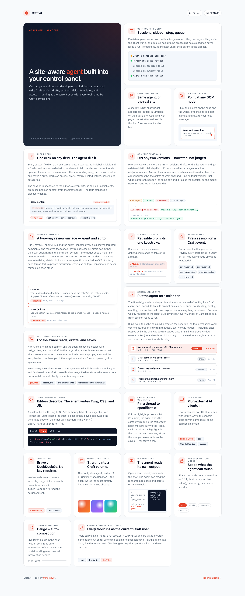
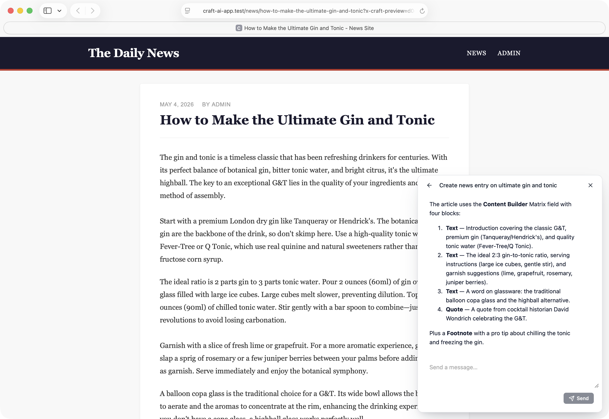

# Craft AI

Craft AI brings an AI agent into Craft CMS. It adds a control panel chat interface, an optional front-end widget for logged-in control panel users, an MCP server so external AI clients can safely work with your Craft content and project structure, plus first-class authoring features — inline review comments, event-driven automations, user-defined slash commands, and a Code Component field that lets the agent author Twig/CSS/JS components alongside editors.

https://github.com/user-attachments/assets/0a96ecf0-2383-4f04-a704-6f94551977e6



## What it can do

Craft AI gives an LLM access to Craft-aware tools that can:

- Search and inspect entries, drafts, sections, entry types, fields, field layouts, templates, assets, and volumes.
- Create or update entries, drafts, sections, entry types, fields, field layout elements, templates, and assets.
- Apply a draft to its canonical entry (or promote a draft into a new canonical entry) once it's ready to publish.
- Delete entries, drafts, sections, entry types, fields, and assets when the current user has permission.
- Generate images directly into a Craft asset volume via OpenAI (gpt-image-1 / dall-e-3) or Google's Gemini "Nano Banana" model (`gemini-2.5-flash-image`).
- Open a Craft entry or draft in a side-by-side preview pane and read the rendered page back so the agent can iterate on its own output.
- Search the web (Brave or DuckDuckGo, keyless) and fetch webpage content for research and content assistance.
- Leave inline review comments on entries, drafts, individual fields, Matrix blocks, and even specific spans of CKEditor text — then resolve them when the feedback has been addressed.
- Attach Craft assets to chat prompts and fetch images for multimodal inspection.
- Keep per-user AI sessions with conversation history, generated session titles, stop controls, a context-window gauge, automatic conversation compaction, and queued background processing.
- Scope each session's tool surface — pick `full`, `draft`-only, `readonly`, or a `custom` allowlist when you want to keep an agent run on a tighter rail.
- Expose the same Craft tools over MCP using either the built-in HTTP endpoint with OAuth or the console stdio server.

The in-app agent supports Anthropic and OpenAI-compatible providers. OpenAI-compatible configuration can point at alternate base URLs such as Azure OpenAI, Groq, Together, OpenRouter, Ollama, or LM Studio.

## Why install it?

Install Craft AI if you want a site-aware assistant that understands Craft concepts instead of a generic chatbot. It can help editors draft and revise content, help developers inspect and adjust Craft structures, and let external MCP clients interact with the same permission-checked tools your Craft users can access.

Because tools run as the current Craft user, you can grant access per tool through Craft permissions. Admin users automatically pass these checks, while other users can be limited to only the operations they should perform.

## Installation

Install the plugin with Composer:

```bash
composer require markhuot/craft-ai
php craft plugin/install craft-ai
```

Then visit **AI Sessions** in the Craft control panel.

## Configuration

Craft AI looks for a project config file at `config/craft-ai.php`. If the file is missing, the AI Sessions page can copy the plugin's example config into place for you.

At minimum, set a provider and API key:

```php
<?php

return [
    'provider' => 'anthropic', // or 'openai'
    'apiKey' => getenv('ANTHROPIC_API_KEY'),
];
```

Available settings include:

- `provider`: `anthropic` or `openai`.
- `apiKey`: the provider API key.
- `model`: the main chat model. Defaults are provider-specific.
- `smallModel`: an optional smaller model for lightweight tasks like session titles.
- `system`: an optional system prompt prepended to conversations.
- `baseUrl`: an optional OpenAI-compatible API base URL override.
- `contextWindow`: the model's prompt-token ceiling. Drives the chat UI's context-used gauge and the auto-compaction trigger; defaults are provided for common Anthropic/OpenAI/DeepSeek models.
- `imageProviders`: optional map of image generation providers. Keys registered here add the matching tool to the agent — leave a key out to keep its tool hidden. Multiple providers can be enabled at once and the agent will pick between them per prompt.
- `searchProviders`: web-search backends powering the `search_the_web` tool. `brave` is the default and `duckduckgo` is available as a fallback; set `searchProviders => null` to disable the tool entirely.

To turn on image generation, register one or both providers under `imageProviders`:

```php
'imageProviders' => [
    'openai' => [
        'apiKey' => getenv('OPENAI_API_KEY'),
    ],
    'gemini' => [
        'apiKey' => getenv('GEMINI_API_KEY'),
        // Optional, defaults to 'gemini-2.5-flash-image'.
        'model' => 'gemini-2.5-flash-image',
    ],
],
```

Registering `openai` exposes the `generate_image_gpt_image` tool (gpt-image-1 / dall-e-3); registering `gemini` exposes `generate_image_nano_banana` (gemini-2.5-flash-image). See `src/config.php` for the full list of options.

After configuration, make sure your Craft queue is running so agent jobs can process in the background.

## Using Craft AI

### Control panel chat

Open **AI Sessions** in the control panel to start a new conversation. The chat UI supports:

- **Ongoing sessions** with message polling while the agent works, a stop control for runaway runs, and queued background processing so the conversation survives a page reload.
- **Asset attachments** — drop one or more Craft assets onto a prompt and the agent will fetch them when needed.
- **A resizable preview pane** the agent can drive when it's working on an entry or draft, with sticky URL state so reopening the pane picks up where it left off.
- **A collapsible sessions sidebar** that nests forked discussions (see *Review comments* below) under their parent with a dotted connector, so it's clear at a glance which conversations belong together.
- **Per-session tool modes** (`full` / `draft` / `readonly` / `custom`) so you can scope which tools the agent can call for that conversation.
- **A context-window gauge** and an automatic compaction step that summarizes prior turns when the conversation approaches the model's limit — you can also invoke it manually with the built-in `/compact` slash command.

### Front-end widget

For logged-in users with control panel access, Craft AI injects a small site widget on front-end pages. The widget reuses the same sessions and chat flow as the CP, making it easy to ask site-aware questions while browsing the site. The widget can:

- Capture the current page's URL and rendered template as context for the next message, so the agent knows where the user is when they ask "what's wrong with this hero?".
- Let the user **click an element on the page** to attach it to the prompt as a target — the agent gets the selector, surrounding markup, and visible text, so feedback can land on a specific component.
- Persist its open/closed state in `localStorage` so the widget stays out of the way once dismissed.



### Review comments

The agent can leave inline review comments on entries, drafts, and individual fields — including fields _inside_ Matrix blocks, and specific spans of text inside CKEditor fields. Comments surface as a popover on the matching entry edit screen and as an `ai/comments` index in the control panel; resolved comments disappear from the open-comment indicators but stay in the database for traceability.

- **`/review entry:123` or `/review draft:456`** — the built-in slash command kicks off an autonomous editorial review of an entry or draft. The agent inspects each field, leaves targeted comments, and resolves them later once the feedback has been addressed.
- **Forked discussion sessions** — when the user opens a comment thread from the entry edit screen, Craft AI forks a new chat session seeded with the parent transcript up through the moment the comment was created. The fork shows up indented beneath its parent in the sessions sidebar, so trampling between threads is impossible.
- **CKEditor span comments** — when `craftcms/ckeditor` is installed, the Comment plugin appears in the CKEditor toolbar. Selecting text and clicking Comment mints a fresh agent session anchored to that exact span; the agent's reply (and the user's reply to that reply) lands as messages in the new session.
- **Matrix-block scoping** — each Matrix block is a first-class entry in Craft 5, so comments target the block's own entry ID rather than the outer Matrix field. The popover walks up the block hierarchy to surface every comment in the page.

### Slash commands

Slash commands let you bake a reusable prompt into a single keystroke. The plugin ships built-ins:

- **`/compact`** — summarize the conversation so far and discard prior turns to free up the context window.
- **`/review`** — autonomous editorial review of an entry or draft (see above).

You can also define your own under **Settings → Craft AI → Slash commands**. Each command pairs a slug-safe name (e.g. `translate`) with a prompt template that supports a `{args}` placeholder for whatever the editor types after the slash. Two are seeded by default — `translate` and `editorial-review` — so you can see the shape before authoring your own. Commands live in plugin settings, which means they round-trip through project config and are version-controllable.

### Automations

Automations fire a new agent session whenever a Craft event matches a rule you've configured. Set them up under **Settings → Craft AI → Automations**. Each rule pairs:

- An **event**: `entry.saved` (canonical entry only), `draft.saved`, `draft.applied`, `entry.deleted`, or `asset.saved`.
- An optional **scope**: entry-shaped events filter by section handle; asset-shaped events filter by volume handle. Leave the scope empty to fire site-wide.
- A **prompt** that becomes the user's first message in the resulting session.

Use automations for things like "review every saved draft in the Blog section" or "alt-text any image uploaded to the Editorial volume". Like slash commands, automations live in plugin settings and are project-config-friendly.

### Code Component field

The **Code Component** field stores a small reusable component made of three authoring tabs — **Twig**, **CSS**, and **JavaScript** — alongside an agent-driven **Prompt** tab. Editors can hand the agent a natural-language description and it will write the component back into the same field; developers can review and tweak the generated code on the other tabs.

- **Per-tab permissions** gate who can see and edit each tab in the control panel. Admins implicitly see all four; non-admins only see the tabs their permissions allow.
- **Render from a template** with `{{ entry.<handle>.render() }}` — the field's value is a `Twig\Markup`, so it interpolates without `|raw`.
- **Live writeback** — the agent uses the `update_code_component` tool to write to the same field, so changes round-trip immediately and the editor sees them on the next save.

### MCP clients

Craft AI exposes its tools through MCP so external AI clients (Claude Desktop, Cursor, custom agents, etc.) can use the same Craft-aware operations:

- **HTTP transport** is available at `/mcp` and uses the plugin's OAuth endpoints (`/.well-known/oauth-authorization-server`, `/.well-known/oauth-protected-resource`, `/craft-ai/oauth/*`) for authorization. Each client gets a Craft user identity, and tool calls run through the same permission checks as the in-app agent.
- **Stdio transport** is available through the Craft console command `php craft mcp/serve --user=<username>`. The required `--user` flag pins the session to a specific Craft user so the stdio server inherits that user's tool permissions instead of running unscoped.

Tools also carry a `kind` (`read`, `draftWrite`, `liveWrite`) so an MCP client UI can render approval prompts that distinguish a search from a publish.

## Development

This repository includes PHP and TypeScript test/build tooling:

```bash
vendor/bin/pest
vendor/bin/phpstan analyze
bun test
bun run typecheck
bun run build
```

The front-end bundles for the chat interface, widget, code component field, comments overlay, and CKEditor comment plugin are all built with Bun.
