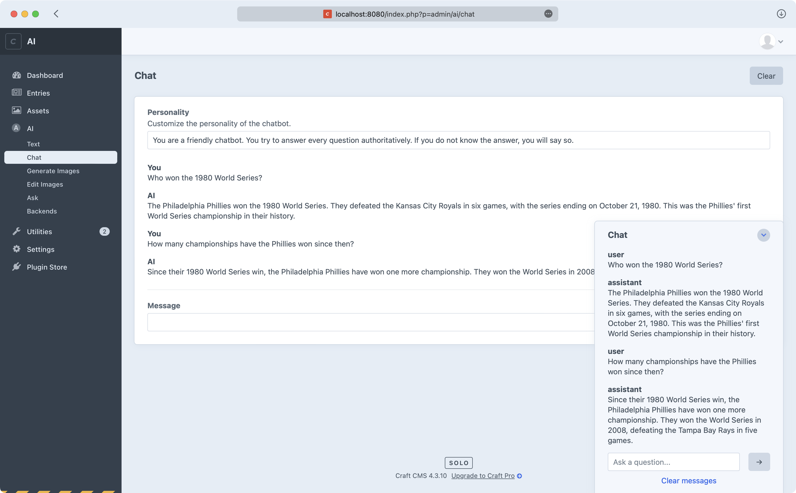

# Craft AI

An intelligent integration for [Craft CMS](https://craftcms.com/).


Craft AI provides additional AI functionality to Craft CMS, including:

- Generating image assets from text prompts
- Generating caption text from existing assets
- Editing image assets with AI-powered inpainting
- Completing text prompts via the Redactor field or a stand-alone form
- Editing text via the Redactor field or a stand-alone form
- Intelligent chat with an AI powered virtual assistant powered by your site's content
- Semantic kNN search of site content

Each of these can be enabled and disabled per-backend.

## Getting started

First you need to install the plugin either through the Craft plugin store or in your terminal by running
`composer require markhuot/craft-ai`. Once the plugin has been downloaded it must be installed in the
Craft UI or in your terminal with `php craft plugin/install ai`.

After the plugin is installed you should see a new "AI" menu in the Craft control panel. Clicking on AI
will bring you to the plugin's settings page. Here you can enable and disable the various AI backends. Each
backend is capable of providing multiple features. For example installing the "Stable Diffusion" back-end
only provides image generation and editing features while installing Open AI provides text generation and
editing as well.

You can click on each backend's name to install it. The backend will require a name and URL in order to
function. The name is used to identify the backend in the Craft control panel. The URL is used to connect
to the backend. Both are pre-filled for you out of the box.

All backends also require some sort of API key. You can find a deep link to the generate an API key on
each backend's settings page. For example,


## Using fake data

Each backend offers a "free" tier during your initial sign up. If you've exhausted your free tier you can
also disable "Use Live Data" on the plugin settings page. This will cause the plugin to use fake data
instead of reaching out to the back-end. Note: the fake data does not actually use AI to generate responses.
While it should retain the same approximate shape of a real AI response, it will not be accurate to the
given prompt.

## Generate Text


Text generation takes a prompt and generates the next word or words to complete the thought. The prompt should
be detailed and provide as much context as possible to elicit a meaningful response. For example, if you simply
asked the system "What is baseball?" it would likely respond with a short sentence about the abstract sport of
baseball. However, if you asked a more specific version of the question, such as "What is Major League Baseball
and how is it played in the United States?" it would likely respond with a much more detailed answer. It is common
to write prompts that are several sentences long and lead the AI in a specific direction. Expanding on the
baseball example, you could write,

```
Question: What is Major League Baseball and how is it played in the United States? Respond with several sentences about
the sport of baseball as well as the history of the sport in the United States. Include information about the
most popular teams and players from the last five years.

Answer:
```

## Chat



Chat provides a virtual assistant that uses your site's content to answer questions. The assistant is powered by a series
of call and response style prompts and is capable of using past responses to inform future responses. Note: the chat
backends are limited by the size of the prompt (cumulative across all messages) so you will need to "clear" the messages
periodically in order to avoid hitting the prompt limit.

You may interact with chat either through the dedicated chat page or by using the chat widget in the bottom right of the
control panel. Both interfaces share the same message history.

When interacting with the chat while viewing an element, such as an entry, asset, or user the chat will be passed the
element as additional context. This allows you to ask the chat questions about the element currently being viewed such as
"add a paragraph to this entry with historical information about the subject". Given the preceding example of adding
historical information the chat system would read the currently viewed entry and add contextually relevant history based
on the content of the entry. If the entry was about baseball it would add baseball history. If the entry was about
fine art it would add fine art history.

## Generate images


Images can be generated by a text prompt. Any generated images will be automatically saved to a Craft asset. If you ask
the system for four images the result will be four new assets in the specified volume.

Your prompts should describe the entire image. For example, a prompt of "a cowboy on mars" leaves a lot open to the
interpretation of the AI. Instead you'll want to describe as much of the image as possible such as, "a cowboy wearing a
cowboy hat. The cowboy is a middle aged man wearing a plaid shirt. The horse is brown and white wearing a leather saddle
with a black saddle pad. In the background, behind the cowboy is a martian vista with a lone mountain rising on the
right side."

Each backend has its own defaults and biases so you may want to specify the artistic style of the image. You could request
"an oil painting of a cowboy…" or "a modernist digital drawing…"

Similarly, you'll find some backends are more suitied for photo realism than others and some are better suited for
abstract concepts.

## Edit images


You can use AI to edit parts of an image via inpainting. To inpaint a part of a picture use the eraser too to erase the
part of the image you want to update. Following the same prompt guidelines as generating an image write a prompt that
describes the entire image as well as the update you would like to make.

The resulting edit will be saved a new asset.

## Ask


To use the "Ask" feature you must configure a search backend such as OpenSearch. This can be done by creating a
`config/ai.php` file by copying the default config.

Once configured the search backend will be updated with a vector embedding based on the element's "search keywords" every
time that element is saved.

# LLaMA.cpp

To run LLaMA.cpp you can follow many of the setup instructions from here,

https://til.simonwillison.net/llms/llama-7b-m2

You can download pre-quantized models from here,

https://huggingface.co/TheBloke/LLaMa-13B-GGML/tree/main
https://huggingface.co/CRD716/ggml-vicuna-1.1-quantized/tree/main

Then you'll run the following command,

```bash
./main -m ./models/llama-13b.ggmlv3.q4_0.bin -t 8 -n 128 -p "The winner of the 1980 World Series was "
```
